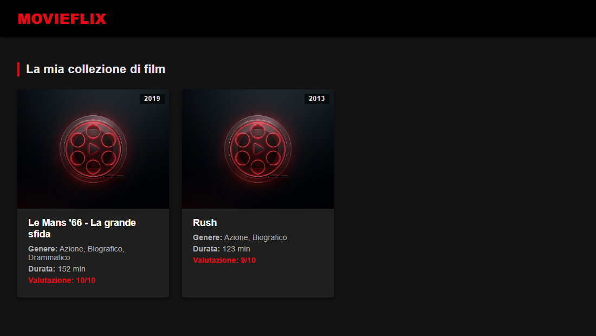

# 🎬 MovieFlix — Collezione Film OOP in PHP

Applicazione web in PHP puro per gestire una piccola collezione di film usando la programmazione a oggetti. Esercizio della specializzazione PHP: l'obiettivo è esercitarsi con classi, proprietà tipizzate, costruttori, trait e organizzazione del codice a oggetti.

Nessun framework, nessuna dipendenza esterna, nessun database: solo PHP 8 e classi, con i dati definiti direttamente nel codice come istanze di oggetti.

## ✨ Funzionalità

- Visualizzazione della collezione film come galleria di card, con locandina, titolo, genere, durata e anno
- Classe `Movie` con proprietà tipizzate (titolo, generi, durata, anno) e costruttore
- Classe `Genre` per rappresentare i generi cinematografici (nome e descrizione)
- Supporto a generi multipli per ogni film, con elenco generato dinamicamente (`getGenresList()`)
- Trait `Rateable` riutilizzabile per aggiungere un sistema di valutazione (voto da 1 a 10) a qualsiasi classe, con validazione dell'intervallo e gestione della proprietà non ancora inizializzata
- Metodo `getFullDetails()` per ottenere una descrizione testuale completa del film

## 📸 Screenshot

| Collezione film |
|---|
|  |

## 🎯 Obiettivi del workshop

La traccia dell'esercizio richiedeva di creare un file `index.php` in cui:

- è definita la classe `Movie`
  - all'interno della classe sono dichiarate delle variabili d'istanza
  - all'interno della classe è definito un costruttore
  - all'interno della classe è definito almeno un metodo
- vengono istanziati almeno due oggetti `Movie` e stampati a schermo i valori delle relative proprietà
- è definita una classe `Genre`
  - all'interno della classe sono dichiarate delle variabili d'istanza
  - all'interno della classe è definito un costruttore
- ogni film ha un genere

**Bonus 1** — Modificare la classe `Movie` in modo che accetti più di un genere.

**Bonus 2** — Aggiungere un Trait alla classe `Movie` con almeno una proprietà e un metodo.

**Bonus 3** — Creare un layout completo per stampare a schermo una lista di film.

La traccia suggeriva inoltre di curare l'organizzazione del codice suddividendolo in file e cartelle dedicati, ad esempio: un file dedicato ai dati (`db.php`), una cartella `Models/` con una classe per file, e un layout separato tra struttura e contenuti. Ho seguito questa indicazione riorganizzando il progetto in `db.php` e `Models/`, con `index.php` ridotto a semplice entry point di presentazione.

## 🛠️ Stack tecnico

- PHP 8 (nessun framework), con type hinting su proprietà e costruttori
- HTML5 / CSS3
- Programmazione a oggetti: classi, trait, incapsulamento delle proprietà

## 📁 Struttura del progetto

```
ex-php8-oop-movie/
├── css/
│   └── style.css        # Stili dell'applicazione
├── img/
│   └── poster-placeholder.jpg  # Locandina segnaposto
├── Models/
│   ├── Genre.php         # Classe Genre (nome, descrizione)
│   ├── Movie.php         # Classe Movie (usa il trait Rateable)
│   └── Rateable.php      # Trait per la gestione del voto (1-10)
├── db.php                 # Istanze di esempio (generi e film)
├── index.php               # Entry point: presenta la collezione film
└── README.md
```

## 🚀 Come avviare il progetto

### Requisiti

- PHP 8.0 o superiore
- Un server web (es. XAMPP, Apache, Nginx) oppure il server integrato di PHP

### Con XAMPP

1. Clona o copia il progetto nella cartella `htdocs` di XAMPP:
   ```
   git clone https://github.com/francesco-cassese/ex-php8-oop-movie.git
   ```
2. Avvia Apache dal pannello di controllo di XAMPP
3. Visita `http://localhost/ex-php8-oop-movie/`

### Con il server integrato di PHP

```
git clone https://github.com/francesco-cassese/ex-php8-oop-movie.git
cd ex-php8-oop-movie
php -S localhost:8000
```

Poi visita `http://localhost:8000`.

## 🔎 Come funziona

- `db.php` crea alcune istanze di `Genre` e di `Movie`, assegnando a ciascun film uno o più generi e un voto tramite `setVote()` (fornito dal trait `Rateable`).
- `index.php` include `db.php`, ottiene l'elenco dei film e ne stampa una card per ciascuno, mostrando titolo, generi (tramite `getGenresList()`), durata, anno e valutazione (tramite `getRatingStars()`).
- La classe `Movie` usa il trait `Rateable` per ereditare la logica di valutazione senza duplicare codice, mentre `getFullDetails()` costruisce una descrizione testuale completa del film.
- Il trait `Rateable` valida che il voto sia compreso tra 1 e 10 e gestisce il caso in cui la proprietà `vote` non sia ancora stata impostata, restituendo un messaggio di default.

## 👤 Autore

Francesco Cassese
